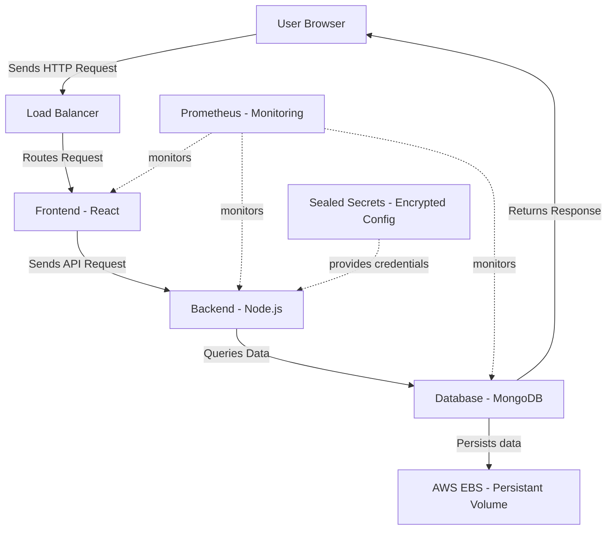

# project-ares
Multi-Service, Three-Tier E-Commerce Web Architecture

Executive Summary: Project Ares is a production-grade, multi-service, three-tier e-commerce architecture — engineered to eliminate business loss caused by cascading failures and wasted infrastructure spending. Each service (Frontend, Backend, Database) is independently deployable via Helm Charts, independently scalable, and independently recoverable. Persistent data survives pod failures through StatefulSets backed by AWS EBS storage. Secrets are cryptographically sealed — safe in public repositories. Real-time anomaly detection via Prometheus and Grafana catches performance degradation before it becomes downtime — reducing mean time to recovery from hours to seconds.

## Architecture Diagram

## Tech Stack
**Application**
- React
- Node.js
- MongoDB

**Infrastructure**
- Docker
- Kubernetes
- Helm
- Prometheus
- Grafana
- Sealed Secrets
- AWS EBS
## Project Structure

```
project-ares/
├── frontend/               # React frontend service
├── backend/                # Node.js backend API
├── helm/                   # Helm charts for all services
├── k8s/                    # Kubernetes manifests
├── monitoring/             # Prometheus and Grafana configs
│   ├── prometheus/
│   └── grafana/
└── docker-compose.yaml     # Local development orchestration
```

