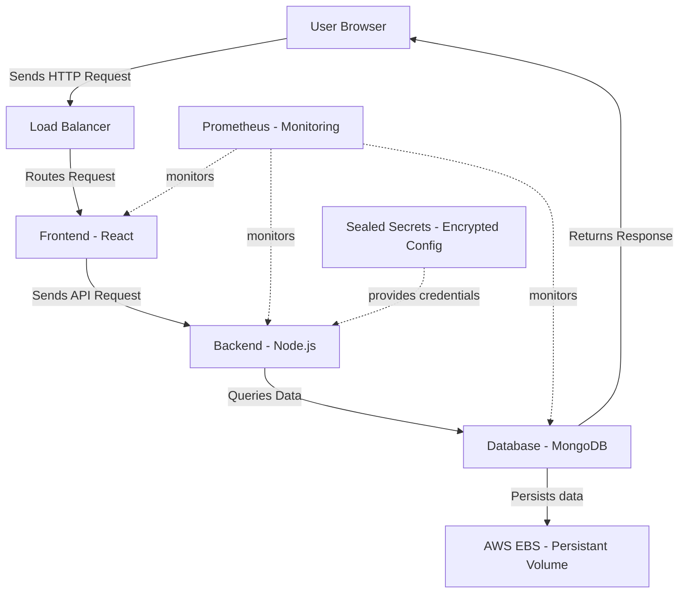

# project-ares
Multi-Service, Three-Tier E-Commerce Web Architecture

Executive Summary: Project Ares is a production-grade, multi-service, three-tier e-commerce architecture — engineered to eliminate business loss caused by cascading failures and wasted infrastructure spending. Each service (Frontend, Backend, Database) is independently deployable via Helm Charts, independently scalable, and independently recoverable. Persistent data survives pod failures through StatefulSets backed by AWS EBS storage. Secrets are cryptographically sealed — safe in public repositories. Real-time anomaly detection via Prometheus and Grafana catches performance degradation before it becomes downtime — reducing mean time to recovery from hours to seconds.

## Architecture Diagram

## Tech Stack
**Application**
- React
- Node.js
- MongoDB

**Infrastructure**
- Docker
- Kubernetes
- Helm
- Prometheus
- Grafana
- Sealed Secrets
- AWS EBS
## Project Structure

```
project-ares/
├── frontend/               # React frontend service
├── backend/                # Node.js backend API
├── helm/                   # Helm charts for all services
├── k8s/                    # Kubernetes manifests
├── monitoring/             # Prometheus and Grafana configs
│   ├── prometheus/
│   └── grafana/
└── docker-compose.yaml     # Local development orchestration
```
# 🚀 Getting Started

## 📋 Prerequisites

Before running this project, ensure you have the following installed on your system:
- **Docker** (Latest version recommended)
- **Docker Compose**

---

## 🛠️ Installation

Follow these steps to set up the project locally:

1. **Clone the repository:**
   ```bash
   git clone https://github.com/Asad881/project-ares.git
   ```

2. **Navigate to the project directory:**
   ```bash
   cd project-ares
   ```

---

## ⚡ Running the Project

Start all the services with a single command:

```bash
docker-compose up
```

**This command will automatically:**
- 🏗️ Build the **Frontend** and **Backend** Docker images.
- 💾 Start the **MongoDB** database container.
- 🌐 Create a isolated network (`ares-network`) for secure service communication.
- 🚀 Ensure all services are up, running, and communicating seamlessly.

---

## 🌐 Accessing the Services

Once all containers are successfully running, you can access them via:

| Service | URL / Port |
| :--- | :--- |
| **Frontend (React)** | 💻 [http://localhost:3000](http://localhost:3000) |
| **Backend API** | ⚙️ [http://localhost:5000](http://localhost:5000) |
| **MongoDB** | 🗄️ `localhost:27017` |

---

## 🛑 Stopping Services

To stop all running containers and clean up the environment, run:

```bash
docker-compose down
```

**What this does:**
- Stops and removes all running project containers.
- Removes the created virtual network.
- 🔒 **Data Safety:** Your database data remains completely safe as the MongoDB volume persists.
