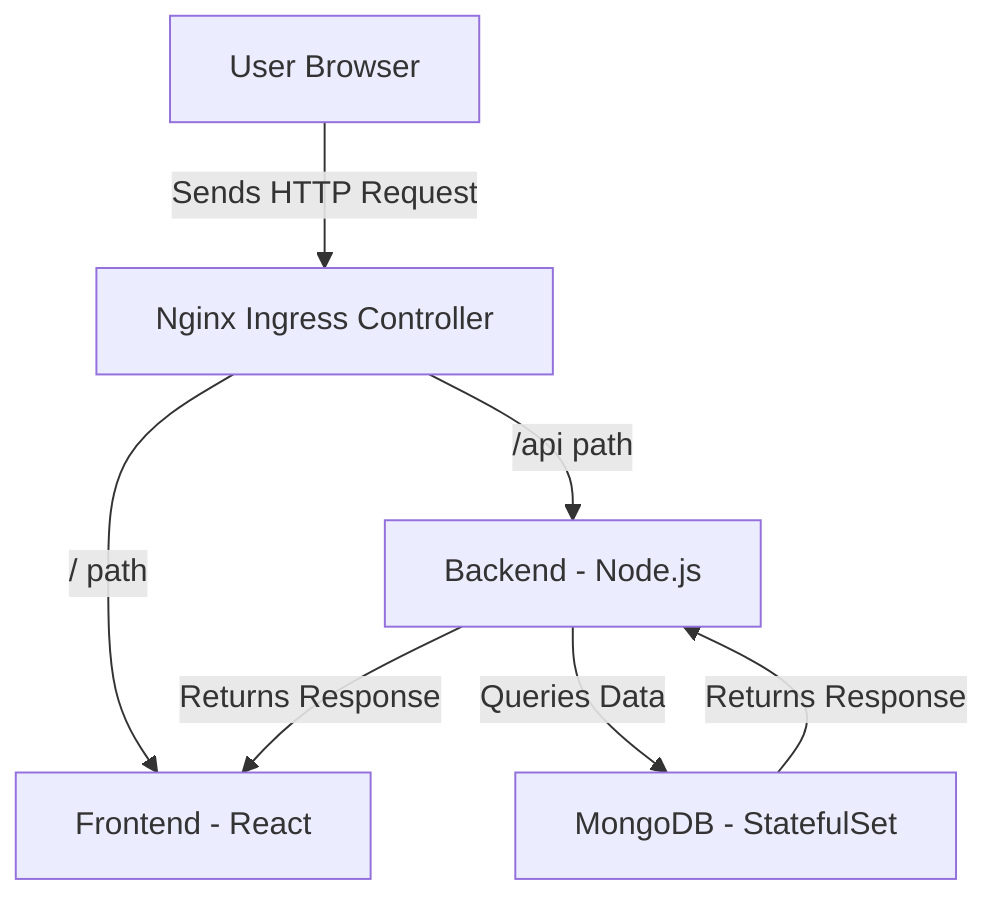

# project-ares
Multi-Service, Three-Tier E-Commerce Web Architecture

## Demo
[Watch Ares in action](https://youtu.be/Rfx1eItljjs)

## Executive Summary
Project Ares is a three-tier e-commerce architecture engineered to eliminate business loss caused by cascading failures and wasted infrastructure spending. Each service (Frontend, Backend, Database) is independently deployable via Helm Charts, independently scalable, and independently recoverable. Persistent data survives pod failures through Kubernetes StatefulSets. External traffic is routed through an nginx Ingress Controller using path-based routing, replacing per-service exposure with a single, centralized entry point.

## Architecture Diagram

```mermaid
graph TD
    A[User Browser] --> |Sends HTTP Request| B[Nginx Ingress Controller]
    B --> |"/ path"| C[Frontend - React]
    B --> |"/api path"| D[Backend - Node.js]
    D --> |Queries Data| E[MongoDB - StatefulSet]
    E --> |Returns Response| D
    D --> |Returns Response| C
```

## Tech Stack
**Application**
- React
- Node.js
- MongoDB

**Infrastructure**
- Docker
- Kubernetes
- Helm
- Nginx Ingress Controller

## Roadmap (Planned)
- [ ] Prometheus + Grafana monitoring
- [ ] Sealed Secrets for credential management
- [ ] AWS EBS-backed persistent storage (production deployment)

## Project Structure

project-ares/
├── frontend/ # React frontend service
├── backend/ # Node.js backend API
├── ares-chart/ # Helm charts for all services
└── docker-compose.yaml # Local development orchestration


# 🚀 Getting Started

## 📋 Prerequisites

Before running this project, ensure you have the following installed on your system:
- **Docker** (Latest version recommended)
- **Docker Compose**

---

## 🛠️ Installation

Follow these steps to set up the project locally:

1. **Clone the repository:**
```bash
   git clone https://github.com/Asad881/project-ares.git
```

2. **Navigate to the project directory:**
```bash
   cd project-ares
```

---

## ⚡ Running the Project

Start all the services with a single command:

```bash
docker-compose up
```

**This command will automatically:**
- 🏗️ Build the **Frontend** and **Backend** Docker images.
- 💾 Start the **MongoDB** database container.
- 🌐 Create an isolated network (`ares-network`) for secure service communication.
- 🚀 Ensure all services are up, running, and communicating seamlessly.

## Deploying with Helm

Here's how to deploy this project using Helm:

1. **Validate the chart:**
```bash
   helm lint ./ares-chart
```
   This command checks the chart for errors before deploying it.

2. **Install the chart:**
```bash
   helm install ares ./ares-chart
```
   This installs and deploys the chart, giving the release a name (`ares`) so it can be easily identified and managed later.

3. **Verify the deployment:**
```bash
   kubectl get all
```
   This shows the status of all pods, services, and deployments, so you can confirm everything is running correctly or locate where an error occurred.

---

## 🌐 Accessing the Services

Once all containers are successfully running, you can access them via:

| Service | URL / Port |
| :--- | :--- |
| **Frontend (React)** | 💻 [http://localhost:3000](http://localhost:3000) |
| **Backend API** | ⚙️ [http://localhost:5000](http://localhost:5000) |
| **MongoDB** | 🗄️ `localhost:27017` |

---

## 🛑 Stopping Services

To stop all running containers and clean up the environment, run:

```bash
docker-compose down
```

**What this does:**
- Stops and removes all running project containers.
- Removes the created virtual network.
- 🔒 **Data Safety:** Your database data remains completely safe as the MongoDB volume persists.

---

## Ingress & Traffic Routing

### Path-Based Routing Strategy

External traffic entering the cluster is managed via `ares-chart/templates/ingress.yaml` and routed based on the following path rules:

* `/` → frontend-service (Serves the React client application)
* `/api` → backend-service (Serves the Node.js API endpoints)

Both routes use `pathType: Prefix`. This ensures all nested client-side routes (e.g., `/products`, `/cart`) and nested backend API endpoints (e.g., `/api/users/123`) are evaluated correctly using Longest Prefix Matching.

### Architectural Isolation

* **MongoDB Service**: Excluded from the Ingress rules entirely.
* Database traffic remains 100% internal to the cluster.
* The backend communicates with MongoDB via standard Cluster DNS, ensuring zero external exposure.

### Status

**Live.** The nginx Ingress Controller is deployed and actively routing traffic to the frontend and backend services based on the path rules above.